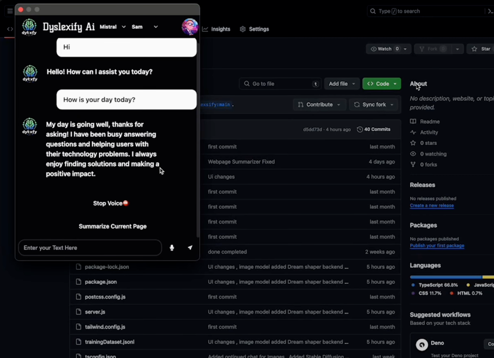
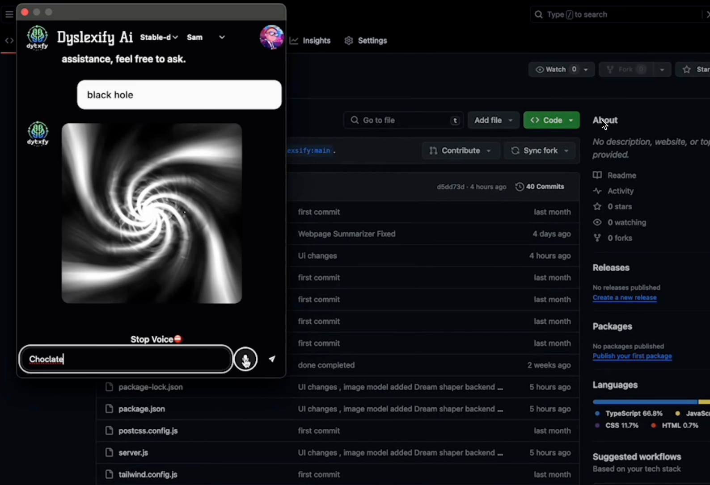

# 🚀 Dyslexify-AI — Assistive AI for Dyslexia & Reading Enhancement

A browser-based platform and Chrome extension that helps users read and comprehend text more easily using AI-powered **text-to-speech**, **summarization**, and **UI accessibility features**.

---

## 📸 Project Preview
<!--
📌 Add screenshots or GIFs of the UI here
Example:

-->



---

## 🎥 Demo Video
<!--
📌 Paste your YouTube demo link here
Example:
https://youtu.be/xxxxxxxxx
-->
[https://youtu.be/6lfNEanxTwg?si=RJN38p7_UJrJ2oSC](https://www.youtube.com/watch?v=tEu_dngseQM)

---

## 🧠 Overview
Dyslexify-AI is designed to support individuals who struggle with reading comprehension.  
The platform and browser extension automatically extract webpage content and assist with:

- 🗣️ AI-driven text-to-speech
- ✂️ One-click summarization of large articles
- 🌗 Accessible UI with dark/light mode
- 🔐 Secure usage of AI API keys

Built as a team of 3 for a college hackathon, with a focus on usability, speed, and accessibility.

---

## ✨ Key Features

✔️ **Full webpage summarization with AI**  
✔️ **Text to speech** — natural voice output  
✔️ **Chrome Extension** — use directly on any webpage  
✔️ **Dark/Light Mode toggle**  
✔️ **Secure API Key Implementation**  
✔️ **Clean and intuitive UI**

---

## 🛠️ Tech Stack

### Frontend
- React
- TypeScript
- JavaScript
- HTML/CSS

### Backend
- Node.js
- Express.js

### AI Integration
- Llama 3 API
- GPT-3.5 API
---

## 📁 Folder Structure
```bash
project/
├── client/           # Frontend
│   ├── src/
│   ├── public/
│   └── ...
├── server/           # Backend API
│   ├── routes/
│   ├── models/
│   ├── controllers/
│   └── ...
├── infra/            # Optional: Terraform / Docker / Deployment config
└── README.md
